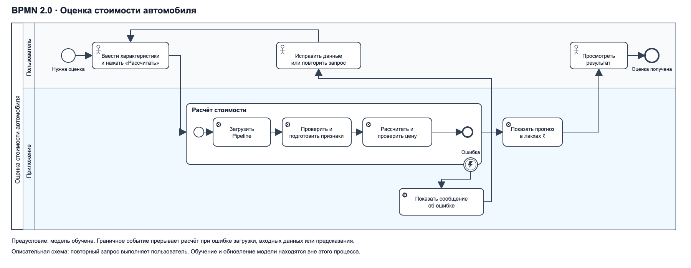

# BPMN — процесс оценки стоимости автомобиля

Редактируемая схема находится в [car_price_process.bpmn](car_price_process.bpmn).
Это BPMN 2.0 XML с координатами BPMN DI. Откройте файл в редакторе,
поддерживающем BPMN 2.0; [PNG](car_price_process.png) подходит для вставки в отчёт, [SVG](car_price_process.svg) — для масштабирования без потери качества.
Нотация и XML-схемы сверены со [спецификацией OMG BPMN 2.0.2](https://www.omg.org/spec/BPMN/2.0.2/).

## Участники и границы

Один пул — «Оценка стоимости автомобиля», две дорожки — «Пользователь» и «Приложение».
Схема описывает запрос в уже работающем Streamlit-приложении.
Модель предварительно обучена через `car-train`. Обучение, запуск сервера и обновление
данных находятся вне этого процесса. Файл описательный (`isExecutable=false`):
BPMN-движок в проект не встроен.

## Основной сценарий

1. Пользователю нужна оценка стоимости.
2. Пользователь вводит характеристики и нажимает «Рассчитать стоимость».
3. Приложение выполняет подпроцесс расчёта:
   - загружает сохранённый Pipeline либо получает его из кеша;
   - проверяет входные данные и готовит признаки;
   - рассчитывает цену и проверяет конечность и неотрицательность результата.
4. Приложение показывает прогноз в лакхах индийских рупий.
5. Пользователь просматривает результат; процесс завершается.

## Ошибки и повторный запрос

Прерывающее граничное событие ошибки прикреплено к подпроцессу расчёта.
Оно описывает переход при отсутствии модели, некорректных данных или ошибке
предсказания. Приложение показывает сообщение; пользователь исправляет данные
или повторяет запрос. Поток возвращается к вводу характеристик.

Если модель отсутствует или требует переобучения, перед повторным запросом
необходимо выполнить `poetry run car-train`. Эта операция выполняется отдельно
и не изображается как автоматическое действие пользователя в интерфейсе.
Некорректная конфигурация при старте приложения находится за границами схемы.

## Связь с кодом

| Элемент | Реализация |
| --- | --- |
| Ввод, кнопка и вывод результата | `src/car_price/ui.py`, функция `main` |
| Загрузка модели и кеш | `ui.cached_model`, `predict.load_model` |
| Проверка и подготовка признаков | `features.validate_features`, `features.prepare_features` |
| Прогноз и проверка цены | `predict.predict_prices` |
| Сообщение об ошибке | Обработчики исключений в `ui.main` |

В схеме используются события начала и завершения, пользовательские и сервисные
задачи, развёрнутый подпроцесс, граничное событие ошибки и потоки последовательности.
Шлюз не добавлен: переход при исключении выражен граничным событием, а не отдельным
условием в пользовательском сценарии.
